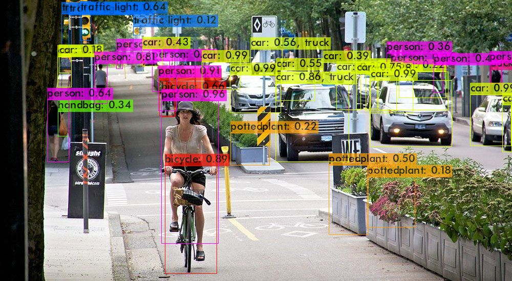
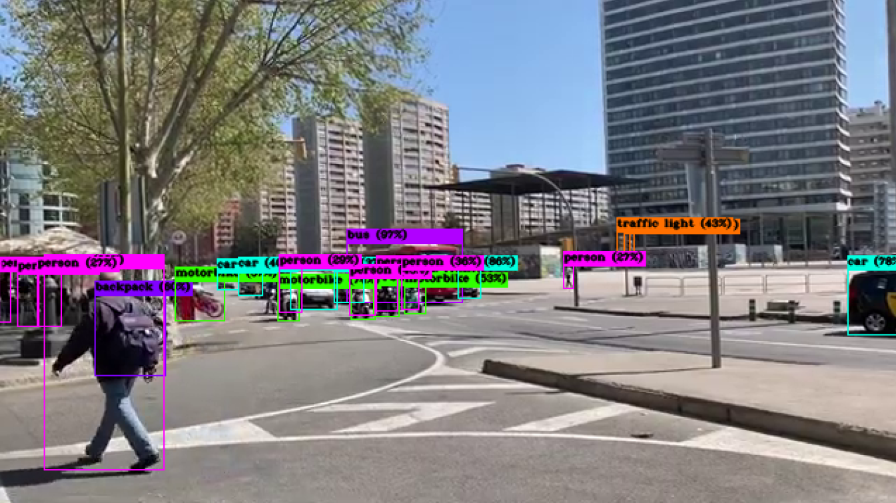

# YOLO v4 Detector for Linux with CPU running

## Initiation

cd darknet_yolov4_cpu

sh download_weights.sh

make

## you can run detector test using image file

./darknet detector test ./cfg/coco.data ./cfg/yolov4.cfg ./yolov4.weights data/bicycle_road.jpg -i 0 -thresh 0.1

(you can see the result at the predictions.jpg)

## you can run detector demo using video file

./darknet detector demo cfg/coco.data cfg/yolov4-tiny.cfg yolov4-tiny.weights data/road_traffic.mp4 -thresh 0.25

(If your CPU is good enough, you can choose yolov4.cfg and yolov4.weights instead of yolov4-tiny)

./darknet detector demo cfg/coco.data cfg/yolov4.cfg yolov4.weights data/road_traffic.mp4 -thresh 0.25

(or you can adjust threshold smaller one like 0.1 : more performance required)

## you can run detector demo using webcam real-time

./darknet detector demo cfg/coco.data cfg/yolov4-tiny.cfg yolov4-tiny.weights -i 0 -thresh 0.25

(if use usb webcam, '1' or corresponding number instead of '0'. 0 means that use integrated webcam)

Thank you so much!

Sangjun